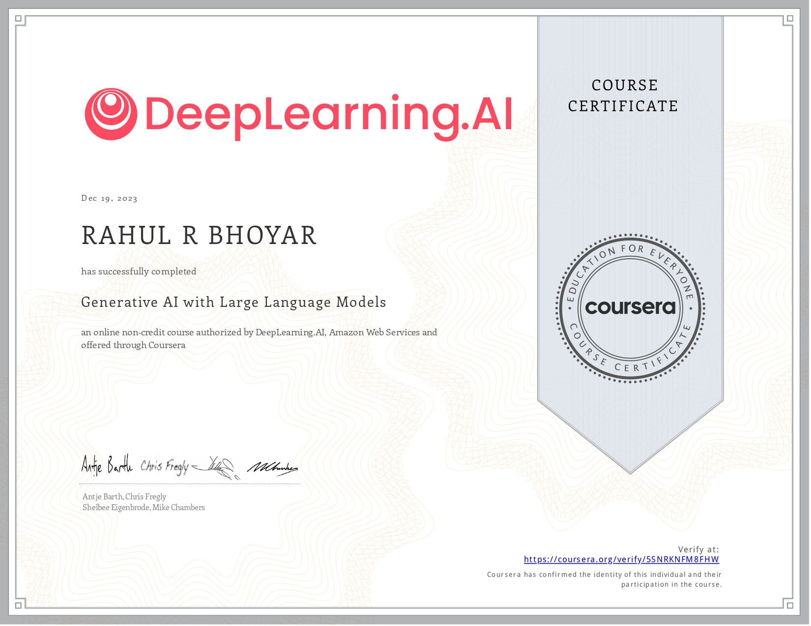

## Coursera Generative AI with Large Language Models Certificate

by **DeepLearning.ai**

#### Author : Mr.Rahul Bhoyar

Welcome to the Git repository for the **Coursera Generative AI with Large Language Models Certificate**. This repository hosts the code and materials essential for mastering generative AI techniques using large language models. Dive into the world of artificial intelligence, explore cutting-edge algorithms, and learn how to generate text, images, and more. With comprehensive resources and practical exercises, this certificate program equips you with the skills to create innovative AI-driven solutions. Join us on this exciting journey into the realm of generative AI and unleash your creativity with large language models. 

**Grade Achieved :**

89.80%

**Certificate :**

Specialisation completed on **19th December 2023**.

**Link for verification :**

[https://www.coursera.org/account/accomplishments/verify/5SNRKNFM8FHW]()
